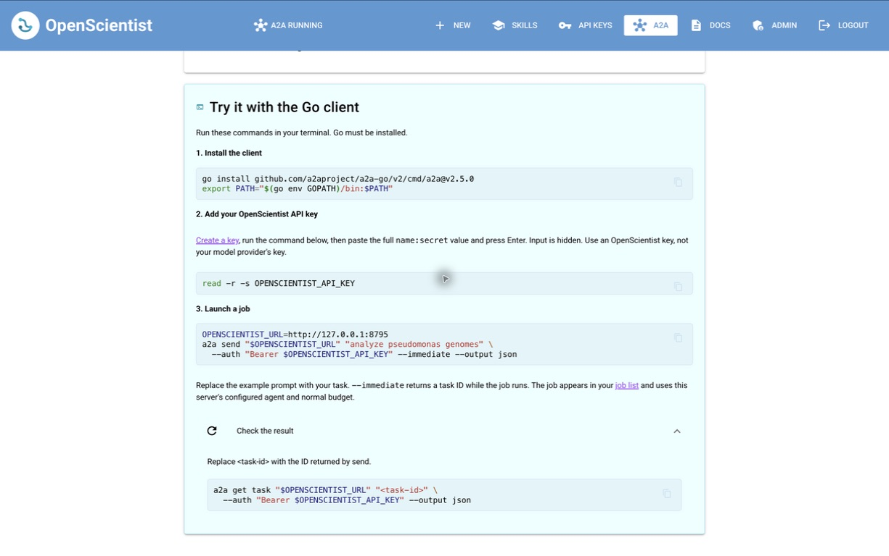

# Agent-to-agent access

OpenScientist exposes one agent named `openscientist` through A2A 1.0 JSON-RPC
on its existing web server. A client sends a plain-text prompt; the endpoint
creates an ordinary discovery job owned by the authenticated user. The job
appears in the same UI and uses the existing job manager, queue, budget checks,
agent backend, provider, model, tools, and container execution path. There is
no separate agent process or domain logic in the transport.

## Enable and control

Install dependencies with `uv sync`, apply `uv run alembic upgrade head`, and
start OpenScientist normally. A2A starts enabled after migration and requires
an existing API key for all task operations.

The navigation header shows **A2A running**, **A2A off**, or **A2A unavailable**
when the state cannot be confirmed. Click it, or the **A2A** navigation entry,
to open `/a2a-settings`. The page displays the discovery and RPC URLs. An
administrator can turn A2A off or on; other users can view connection details
and follow the link to create or revoke API keys. Changes persist in
PostgreSQL and other open pages refresh within five seconds.

The same page includes a **Try it with the Go client** box with copyable install,
API-key entry, send, and get commands. The commands use this deployment's URL;
the API key is entered privately in the caller's terminal.



Turning off blocks discovery and all subsequent A2A requests with HTTP 503,
including get, list, cancel, and callers with cached agent cards. Already
accepted jobs and waiting send requests continue. Manage those jobs in the UI,
or re-enable A2A to poll them again. The rest of the OpenScientist API remains
available.

Set the existing `APP_URL` to the externally reachable application base,
including any reverse-proxy path prefix. Discovery uses this URL; A2A does not
introduce a second public-URL setting. Remote deployments should use HTTPS.

| Route | Access | Purpose |
| --- | --- | --- |
| `GET /.well-known/agent-card.json` | Public while enabled | Discovery and advertised bearer authentication |
| `POST /a2a` | Existing API key | `SendMessage`, `GetTask`, `ListTasks`, `CancelTask` |
| `GET /api/v1/a2a/settings` | Existing API key | Status and connection URLs |
| `PUT /api/v1/a2a/settings` | Administrator's API key | `{"enabled": false}` or `{"enabled": true}` |

## Call it from Go

Use the official [A2A Go SDK and CLI](https://github.com/a2aproject/a2a-go).
The examples use its v2.5.0 CLI and A2A 1.0 wire format:

```bash
go install github.com/a2aproject/a2a-go/v2/cmd/a2a@v2.5.0

export OPENSCIENTIST_URL=http://localhost:8080
# Obtain this in OpenScientist's API Keys page; do not use a provider key.
read -s OPENSCIENTIST_API_KEY
export OPENSCIENTIST_API_KEY

a2a discover "$OPENSCIENTIST_URL"
a2a send "$OPENSCIENTIST_URL" 'analyze pseudomonas genomes' \
  --auth "Bearer $OPENSCIENTIST_API_KEY" --immediate --output json

# Use the returned task id (also the OpenScientist job id).
a2a get task "$OPENSCIENTIST_URL" '<task-id>' \
  --auth "Bearer $OPENSCIENTIST_API_KEY" --output json
a2a list tasks "$OPENSCIENTIST_URL" \
  --auth "Bearer $OPENSCIENTIST_API_KEY" --output json
a2a cancel "$OPENSCIENTIST_URL" '<task-id>' \
  --auth "Bearer $OPENSCIENTIST_API_KEY"
```

`--immediate` is useful for long-running jobs. Alternatively, `--stream` in the
Go CLI falls back to polling because this agent advertises no streaming
support; choose a timeout appropriate for the job. In SDK clients, configure
the same bearer header on every task request.

A minimal JSON-RPC send is:

```json
{
  "jsonrpc": "2.0",
  "id": "request-1",
  "method": "SendMessage",
  "params": {
    "message": {
      "messageId": "message-1",
      "role": "ROLE_USER",
      "parts": [{"text": "analyze pseudomonas genomes"}]
    },
    "configuration": {"returnImmediately": true}
  }
}
```

Send `Content-Type: application/json`, `A2A-Version: 1.0`, and
`Authorization: Bearer <name>:<secret>`. Send returns `result.task`; get and
cancel return a task directly in `result`. Without `returnImmediately`, send
waits until the job completes, fails, is canceled, or needs input. Disconnecting
the HTTP client does not cancel accepted execution.

## Lifecycle and limits

The agent uses the normal UI/job-manager defaults: ten iterations, autonomous
mode, hypothesis tracking off, and no uploaded files. Provider and model are
captured by the job manager from the server's existing configuration. A2A
does not infer different workflows from prompt contents or let callers override
credentials, backend, filesystem paths, or execution settings. Use the normal
UI or REST API when those job options or file uploads are needed.

One A2A task and context correspond to one job. This initial version does not
translate A2A follow-ups into job chat or iteration feedback: sending a
`taskId` or `contextId` is rejected. Use the job UI for those interactions, or
omit both fields to submit another job.

| Job status | A2A state |
| --- | --- |
| pending / queued | `TASK_STATE_SUBMITTED` |
| running / generating_report | `TASK_STATE_WORKING` |
| awaiting_feedback | `TASK_STATE_INPUT_REQUIRED`, with a link to the job UI |
| completed | `TASK_STATE_COMPLETED` |
| failed | `TASK_STATE_FAILED` |
| cancelled | `TASK_STATE_CANCELED` |

The completed task includes the final Markdown report as text, falling back
to the stored result summary or consensus answer when no report is present.
If none is available, status links to the job without inventing output. Text
is bounded at one million characters; a truncation marker directs the caller
to the full report. Logs, reasoning, and intermediate tool output are not
included. Task history contains the original message and available final text.

Terminal results are saved when first observed through A2A and remain stable
across process restarts and later UI reruns. Until that observation, task state
follows the existing job record. Startup recovery uses the job manager's
existing handling of interrupted jobs. Deleting a job deletes its A2A metadata.
Cancellation delegates to the same job-manager action as the REST API and
reports the persisted job status; it is not a guarantee that every subprocess
has already exited. States the manager cannot cancel must be handled in the UI.

Listing includes only A2A jobs owned by the caller, with page sizes up to 100,
context/status/timestamp filters, and optional history/artifacts. The prototype
scans that user's task history; SQL pagination and an indexed state projection
are the upgrade path for large installations. Streaming, push notifications,
file parts, extensions, tenants, multiple configurable agents, and retry
deduplication are unsupported. Retrying a send creates another job.

## Authentication now and future work

Authentication is implemented using OpenScientist's existing API-key system:
`name:secret` bearer credentials, hashed secret storage, revocation, active-user
checks, and usage tracking. Starting a job additionally requires administrator
approval of the account, matching the REST API. Discovery declares the scheme
through `securitySchemes` and `securityRequirements`; it contains no user/job
data or credentials. This follows the
[A2A authentication model](https://a2a-protocol.org/latest/specification/#7-authentication-and-authorization).

Tasks are scoped to the API key's **user**, with explicit owner checks and
PostgreSQL row-level security. Different keys belonging to one user share that
user's task access. Job sharing does not grant A2A access, and API keys belonging
to ordinary users cannot change the deployment-wide switch. UI toggle requests
recheck administrator membership in the database rather than trusting a cached
browser flag. Model-provider credentials remain separate from caller credentials.

Future work can extend the existing authentication boundary with scoped,
expiring service credentials and OAuth access tokens for hosted deployments.
That should include issuer/audience validation, per-client or per-agent scopes,
rate and spending limits, and audit attribution. Any finer-grained scopes must
apply to equivalent REST job operations too, so REST is not a bypass. Tests
should cover expiry, rotation, scope restrictions, and cross-client access
before advertising these features. The current switch remains independent of
authentication: valid credentials do not bypass an off endpoint.

## Validation

`uv run pytest tests/api/test_a2a.py tests/webapp/test_a2a_page.py` uses real
PostgreSQL records, migrations, API keys, RLS, and job creation. Execution and
external budget lookup are replaced in tests, so they incur no model usage.
The UI tests use NiceGUI's browser simulation. Run the full local CI equivalents
with `uv run ruff check src/ tests/`, `uv run ruff format --check src/ tests/`,
`uv run mypy src/openscientist/ tests/`, and `uv run pytest -m "not network"`.
